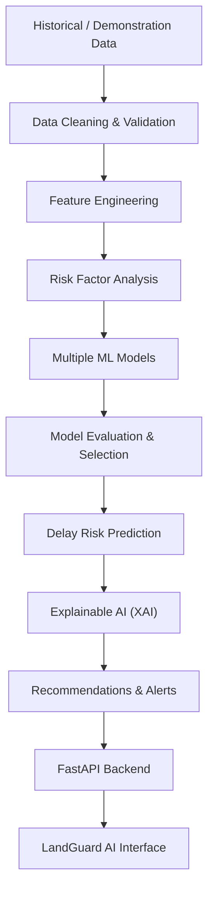

# LandGuard AI 🛡️

**Predictive Analytics System for Early Detection of Land Acquisition Delays**
*Smart India Hackathon 2026 — Problem Statement ID: SIH26017*

> **Organization:** Ministry of Rural Development (MoRD)  
> **Department:** Department of Land Resources (DoLR)  
> **Category:** Software | **Theme:** Agriculture, FoodTech & Rural Development  
> **Tagline:** *"Predict delays. Prevent bottlenecks. Accelerate infrastructure."*

---

## 🏛️ Executive Summary

Major national infrastructure initiatives—including National Highways, Dedicated Freight Corridors, Mining Concessions, Irrigation Reservoirs, and Green Energy Parks—consistently encounter multi-year project overruns attributable to delayed statutory land acquisition under the **Right to Fair Compensation and Transparency in Land Acquisition, Rehabilitation and Resettlement (RFCTLARR) Act, 2013**.

**LandGuard AI** is a production-style, role-based decision support platform built specifically for the **Department of Land Resources (DoLR)** and State Revenue Authorities. Rather than passively reporting historical delays, LandGuard AI evaluates dynamic project risk **before bottlenecks become critical**, providing:
1. **Calibrated Delay Probabilities (%)** and Composite Risk Scores (0–10).
2. **Statutory 9-Stage Acquisition Lifecycle Modeling** (Preliminary Notification through to Final Possession).
3. **Explainable AI (XAI) Attribution** quantifying exact delay drivers (e.g. +Pending compensation: +27%, +Legal disputes: +21%).
4. **Smart Rule + ML Recommendation Engine** routing concrete administrative directives to Responsible Departments (District Collectorates, Revenue Departments, CALA, and Legal Cells).
5. **Interactive GIS Map Explorer** (Leaflet + OpenStreetMap) with geo-spatial risk classification and district boundary tracking.
6. **Time-to-Delay Window Forecasting** (30-day, 60-day, 90-day horizon probabilities).
7. **Continuous Learning & Model Management** with verifiable metric benchmarks and live retraining.

---

## 🏗️ System Architecture

```
┌─────────────────────────────────────────────────────────────────────────────┐
│                      React 19 + TypeScript + Vite Frontend                   │
│  ┌───────────────┬──────────────┬──────────────┬──────────────┬───────────┐  │
│  │ Executive     │ Projects     │ Interactive  │ Explainable  │ Model &   │  │
│  │ Dashboard     │ Registry     │ GIS Leaflet  │ AI & Action  │ Admin     │  │
│  │ & KPI Metrics │ & Detail Hub │ Map Explorer │ Recommender  │ Console   │  │
│  └───────────────┴──────────────┴──────────────┴──────────────┴───────────┘  │
│  ┌────────────────────────────────────────────────────────────────────────┐  │
│  │ GovTech Design System (Tailwind CSS, Lucide Icons, Recharts, Leaflet)   │  │
│  │ Quick Role Switcher for SIH Judges (Admin, State, District, PM, Viewer)│  │
│  └────────────────────────────────────────────────────────────────────────┘  │
└──────────────────────────────────────┬──────────────────────────────────────┘
                                       │ REST / JSON (JWT Auth + RBAC)
┌──────────────────────────────────────▼──────────────────────────────────────┐
│                            FastAPI Python Backend                           │
│  ┌───────────────┬──────────────┬──────────────┬──────────────┬───────────┐  │
│  │ Auth & RBAC   │ Projects &   │ Analytics &  │ Alerts &     │ Document  │  │
│  │ Middleware    │ Stages CRUD  │ Geo-Aggregates│ Notification │ Repository│  │
│  └───────────────┴──────────────┴──────────────┴──────────────┴───────────┘  │
│  ┌────────────────────────────────────────────────────────────────────────┐  │
│  │ Business Logic: RFCTLARR Act Statutory 9-Stage Acquisition Pipeline    │  │
│  └──────────────────────────────────────┬─────────────────────────────────┘  │
└─────────────────────────────────────────┼────────────────────────────────────┘
                                          │
        ┌─────────────────────────────────┴─────────────────────────────────┐
        ▼                                                                   ▼
┌───────────────────────────────────┐       ┌───────────────────────────────────┐
│     Machine Learning & XAI Engine │       │     Data & Persistence Layer      │
│  - Logistic Regression (Baseline) │       │  - SQLite (Local zero-config demo)│
│  - Random Forest & Gradient Boost │       │  - PostgreSQL 16+ compatible      │
│  - Multi-Tree Feature Attribution │       │  - SQLAlchemy 2.0 ORM             │
│  - Duration Regressor (Days)      │       │  - 14 Normalized Tables           │
│  - 30 / 60 / 90-Day Survival Risk │       │  - 1,021 Verified Demo Records    │
│  - Rule + ML Recommendation Engine│       │  - Full Audit Trail Logging       │
└───────────────────────────────────┘       └───────────────────────────────────┘
```

---

## 👥 Role-Based Access Control (RBAC)

LandGuard AI implements five granular user roles tailored for administrative hierarchy:

| Role | Target Officer / User | Scope & Capabilities |
| :--- | :--- | :--- |
| **Administrator** | Joint Secretary / DoLR Director | Full administrative control, user provisioning, system analytics, model retraining, and audit logs. |
| **State Officer** | Principal Secretary (Revenue) | State-level monitoring, inter-district bottleneck comparison, and high-risk alerts. |
| **District Officer** | District Collector / Competent Authority (CALA) | District-level project monitoring, status updates, milestone management, and taking recommended actions. |
| **Project Manager** | Executing Agency Lead (NHAI / RVNL) | Project milestone updates, contractor synchronization, and bottleneck mitigation. |
| **Viewer / Analyst** | NITI Aayog / MoSPI Analyst | Read-only executive dashboards, national trend aggregations, and performance reports. |

> ⚡ **Demo Tip for SIH Judges:** The navigation bar includes an instant **Quick Role Switcher** dropdown allowing judges to test each role's distinct permissions with one click without manually typing passwords.

---

## 🤖 AI / ML Pipeline & Explainable AI (XAI)

### 🔄 End-to-End Data & ML Pipeline Flow

```
Historical / Demonstration Data
            ↓
Data Cleaning & Validation
            ↓
Feature Engineering
            ↓
Risk Factor Analysis
            ↓
Multiple ML Models
            ↓
Model Evaluation & Selection
            ↓
Delay Risk Prediction
            ↓
Explainable AI (XAI)
            ↓
Recommendations & Alerts
            ↓
FastAPI Backend
            ↓
LandGuard AI Interface
```



### 1. Multi-Model Architecture
- **Baseline Classifier:** L2 Regularized Logistic Regression.
- **Ensemble Classifier:** Multi-Tree Random Forest (120 estimators, depth-calibrated).
- **Gradient Boosting:** Stage-wise additive Gradient Boosting Classifier.
- **Duration Regressor:** Random Forest Regressor predicting additional delay in calendar days.
- **Dynamic Selection:** The training pipeline benchmarks Accuracy, Precision, Recall, F1 Score, and ROC-AUC, automatically serializing the top-performing model bundle.

### 2. Statutory Acquisition Features (14 Key Predictors)
1. `land_area_hectares` (Acquisition footprint)
2. `affected_families` (Project Affected Families / PAFs)
3. `compensation_percentage` (% disbursed to bank accounts)
4. `approval_delay_days` (Inter-departmental clearance latency)
5. `legal_disputes_count` (Active writ petitions and Section 64 references)
6. `documentation_complete` (Digitized RoR & cadastral map verification)
7. `notification_complete` (Section 11 Gazette status)
8. `possession_percentage` (Section 38 physical handover progress)
9. `rehabilitation_percentage` (R&R resettlement colony infrastructure)
10. `stakeholder_responsiveness` (Gram Sabha consensus: High, Medium, Low)
11. `historical_district_delay_score` (District revenue throughput index 1–10)
12. `current_stage` (Current stage within the 9 statutory acquisition phases)
13. `project_type` (Highways, Railways, Mining, Irrigation, Solar, Urban)
14. `state` (State administrative jurisdiction)

### 3. Explainable AI (XAI) Waterfall
For every prediction, LandGuard AI computes feature attribution to transparently explain **WHY** a project is delayed:
- `+ Pending Compensation Disbursement (+27%)`
- `+ Active Court Title Disputes (+21%)`
- `+ Statutory Clearance Overdue (+17%)`
- `+ Incomplete Digital Cadastre (+11%)`
- `- Proactive Stakeholder Engagement (-7%)`

---

## 📋 9 Statutory Stages under RFCTLARR Act 2013

Every project's lifecycle is modeled through 9 chronological statutory milestones:
1. **Preliminary Investigation:** Feasibility, SIA (Social Impact Assessment) notification, and public hearing.
2. **Notification (Sec 11):** Official state gazette publication of intention to acquire land.
3. **Land Survey & Demarcation:** Joint cadastral boundary verification and tree/structure counting.
4. **Objection / Legal Hearing (Sec 15):** Hearing of land title and valuation claims by the Collector.
5. **Compensation Assessment:** Determination of market value and solatium award matrix (Sec 26–30).
6. **Compensation Disbursement:** Direct benefit transfer (DBT) of award amounts to PAF escrow accounts.
7. **Rehabilitation & Resettlement (R&R):** Civic amenities, housing allotments, and one-time livelihood grants.
8. **Possession (Sec 38):** Collector takes peaceful physical possession after full compensation award.
9. **Final Acquisition Complete:** Vesting of encumbrance-free title with the State Government.

---

## 🎯 Flagship Demonstration Project: `LA-JH-2026-0042`

To ensure a seamless 5-minute hackathon evaluation, the dataset includes a specially calibrated showcase project:

- **Project ID:** `LA-JH-2026-0042`
- **Project Name:** Ranchi-Jamshedpur 4-Lane Industrial Expressway (NH-33 Extension)
- **State & District:** Jharkhand, Ranchi
- **Area & Impact:** 450.0 Hectares, 620 Affected Families
- **Current Stage:** Compensation Disbursement
- **AI Risk Assessment:**
  - **Risk Score:** `8.4 / 10.0`
  - **Delay Probability:** `84%`
  - **Risk Tier:** `HIGH / CRITICAL`
  - **Predicted Additional Delay:** `68 Days`
  - **Confidence Score:** `89%`
- **Primary Root Causes:**
  1. Severely pending compensation disbursement (only 29.0% released)
  2. 4 active legal title dispute petitions in District & High Court
  3. Forest clearance approval delayed by 68 days
- **Recommended Interventions:**
  1. *Revenue Dept:* Convene Special LAO Lok Adalat for direct bank transfer verification (saves ~45 days).
  2. *Legal Cell:* Refer valuation grievances to State Land Acquisition Authority under Section 64 (saves ~60 days).
  3. *District Administration:* Complete digitized cadastre cross-verification via DILRMP portal.

> ⚡ **Live Demo Recalculation:** In the Project Details view, judges can click **"Update Status & Recalculate Risk"**, increase compensation disbursement to ₹350 Cr, reduce legal disputes to 0, and immediately watch the AI Risk Score drop from **CRITICAL (8.4)** to **LOW (2.1)** in real time!

---

## 🗄️ Database Architecture (14 Normalized Tables)

LandGuard AI operates on SQLAlchemy 2.0 with full PostgreSQL 16+ compatibility and zero-configuration SQLite for local hackathons:

1. `users`: User credentials, roles, state/district scopes, and active status.
2. `projects`: Complete RFCTLARR project metadata and geo-coordinates.
3. `project_stages`: 9 statutory acquisition stages per project with duration and bottlenecks.
4. `project_updates`: Chronological milestone event logs.
5. `compensation_records`: Village cluster disbursement accounting and dispute amounts.
6. `legal_cases`: Court tier, petition numbers, stay order status, and hearing dates.
7. `rehabilitation_records`: PAF entitlements, housing units, and colony possession.
8. `documents`: Uploaded gazettes, SIA reports, and cadastral maps.
9. `predictions`: AI-generated delay probabilities, risk scores, and 30/60/90-day time-to-event metrics.
10. `risk_factors`: Deconstructed XAI feature attribution records.
11. `recommendations`: Department-specific actionable directives with impact metrics.
12. `alerts`: Critical delay threshold breach notifications.
13. `model_versions`: Model registry containing algorithms, metrics, and confusion matrices.
14. `audit_logs`: Immutable trail of user actions, timestamps, and previous/new values.

---

## 🚀 Quickstart Guide

### Prerequisites
- **Python:** 3.10+ (tested on Python 3.11 & 3.13)
- **Node.js:** 18+ (tested on Node v20 & v26)

### Option 1: One-Click Local Run (Recommended)

1. **Clone the repository:**
   ```bash
   git clone https://github.com/your-username/LandGuard.git
   cd LandGuard
   ```

2. **Set up Python Virtual Environment:**
   ```bash
   python3 -m venv .venv
   source .venv/bin/activate
   pip install -r requirements.txt
   ```

3. **Generate Demonstration Dataset & Train ML Models:**
   ```bash
   python scripts/generate_demo_data.py
   python ml/train.py
   ```

4. **Build Frontend:**
   ```bash
   cd frontend
   npm install
   npm run build
   cd ..
   ```

5. **Start Application Server:**
   ```bash
   uvicorn backend.app.main:app --host 0.0.0.0 --port 8000
   ```

6. **Open in Browser:**
   - 🌐 **Web Portal:** [http://localhost:8000](http://localhost:8000)
   - 📚 **Interactive Swagger API Docs:** [http://localhost:8000/api/docs](http://localhost:8000/api/docs)

---

### Option 2: Full Development Mode (Hot-Reload)

- **Backend (Terminal 1):**
  ```bash
  source .venv/bin/activate
  uvicorn backend.app.main:app --reload --port 8000
  ```

- **Frontend (Terminal 2):**
  ```bash
  cd frontend
  npm run dev
  ```
  Open [http://localhost:5173](http://localhost:5173).

---

### Option 3: Docker Deployment

```bash
docker-compose up --build
```
Open [http://localhost:8000](http://localhost:8000).

---

## 🔑 Pre-Configured Demo Credentials

| Role | Official Email | Password | Scope |
| :--- | :--- | :--- | :--- |
| **Administrator** | `admin@landguard.gov.in` | `Admin@123` | National (Full Access & ML Retraining) |
| **State Officer** | `state.officer@landguard.gov.in` | `State@123` | State Level (Jharkhand Nodal Office) |
| **District Officer** | `district.officer@landguard.gov.in` | `District@123` | District Level (Ranchi Collectorate) |
| **Project Manager** | `pm@landguard.gov.in` | `Manager@123` | Executing Agency (NHAI Project Lead) |
| **Viewer / Analyst** | `viewer@landguard.gov.in` | `Viewer@123` | NITI Aayog Read-Only Analyst |

---

## 🧪 Automated Test Suite

To run the complete automated test suite:
```bash
source .venv/bin/activate
pytest tests/test_backend.py -v
```

**Verified Test Coverage:**
- ✅ Health check and database connectivity
- ✅ JWT authentication and role authorization
- ✅ Executive Dashboard KPI aggregation
- ✅ Project pagination, search, and multi-parameter filtering
- ✅ Flagship showcase project `LA-JH-2026-0042` data integrity
- ✅ Standalone AI prediction API with stage breakdown
- ✅ Leaflet GIS GeoJSON endpoint
- ✅ Intelligent alert generation and acknowledgment
- ✅ ML model registry status and metric validation

---

## ⚖️ Real-World Honesty & Disclaimer

In accordance with official hackathon ethics:
> **Notice:** All project records, village figures, and timeline estimates in this demonstration repository are generated synthetic records designated as `"Demonstration Dataset"`. Predictions are generated for system demonstration under Smart India Hackathon 2026 (Problem ID: SIH26017) and should not be used as official administrative or legal decisions without integration with real departmental land registries.

---

## 🔮 Future Scope & Scalability

1. **Satellite Remote Sensing Integration:** Ingesting Sentinel-2 & ISRO Bhuvan optical imagery to automatically detect physical encroachment and ground progress along linear alignment corridors.
2. **DILRMP Live Webhook Integration:** Bi-directional sync with State Digital Land Records Modernization Portals (Bhoomi, Jharbhoomi, Bhulekh) for instantaneous cadastral title verification.
3. **Automated WhatsApp / SMS Gateway:** Automated escalation dispatches to Tehsildars and Special Land Acquisition Officers when statutory 60-day objection deadlines approach.
4. **Natural Language Legal Extraction:** LLM parser for court counter-affidavits to extract stay conditions and valuation dispute amounts automatically.

---

*Developed for Smart India Hackathon 2026 • Ministry of Rural Development • Department of Land Resources (DoLR)*
